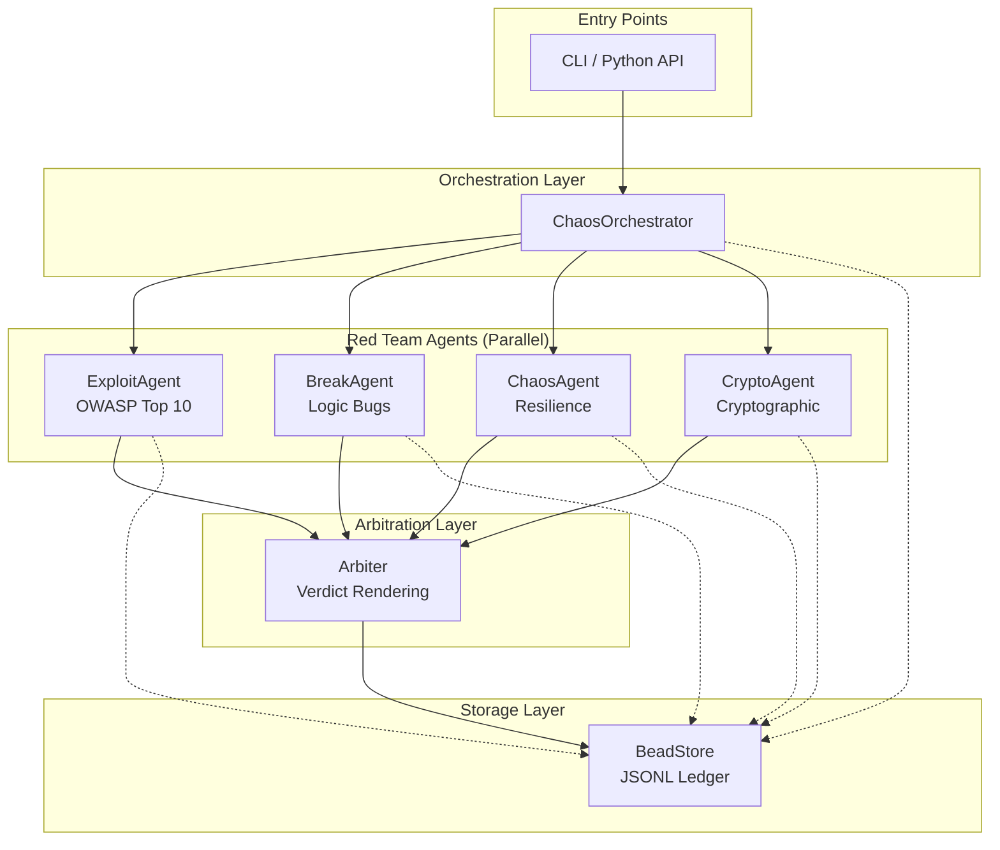
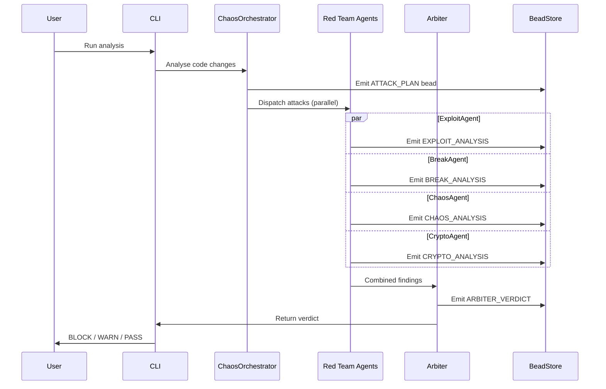
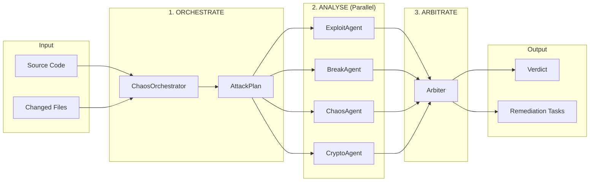
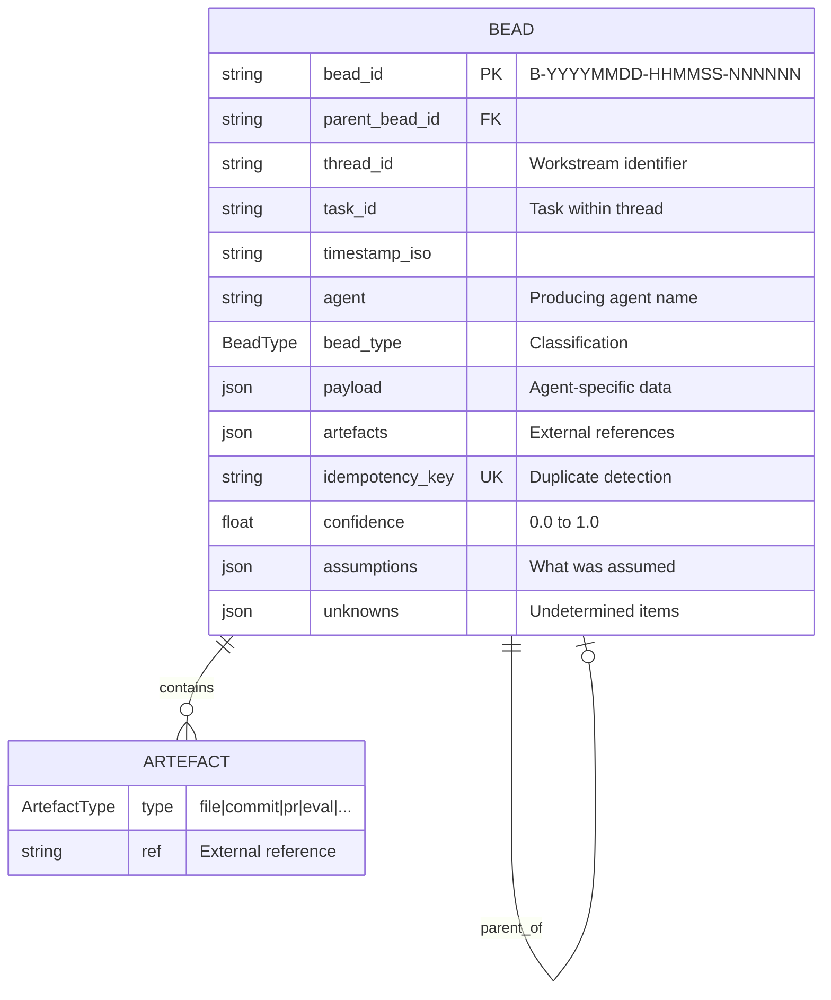
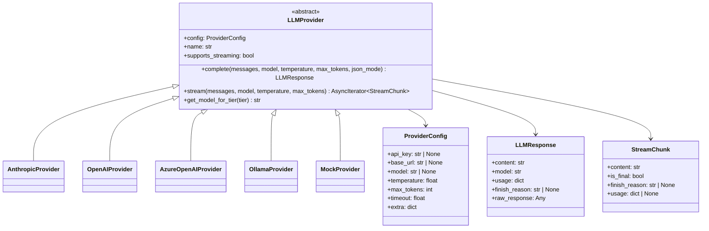

# Architecture Deep Dive

This document provides a comprehensive technical overview of the Adversarial Debate framework, explaining how the multi-agent system works together to identify security vulnerabilities, logic bugs, and resilience issues in code.



## Table of Contents

- [System Overview](#system-overview)
- [High-Level Architecture](#high-level-architecture)
- [Agent Execution Model](#agent-execution-model)
- [Data Flow](#data-flow)
- [Event Sourcing with Beads](#event-sourcing-with-beads)
- [LLM Provider Abstraction](#llm-provider-abstraction)
- [Parallel Execution Strategy](#parallel-execution-strategy)
- [Security Model](#security-model)

---

## System Overview

Adversarial Debate is a **multi-agent AI security testing framework** that simulates a team of expert security researchers conducting adversarial analysis through structured debate. Unlike traditional static analysis tools that rely on pattern matching, this system uses large language models to reason about vulnerabilities in context, understand code semantics, and provide nuanced security assessments.



### Core Design Principles

The framework is built on several key principles that guide its architecture:

**Separation of Concerns** means each agent specialises in a specific type of analysis. The ExploitAgent focuses on OWASP Top 10 security vulnerabilities, the BreakAgent targets logic bugs and edge cases, the ChaosAgent designs resilience experiments, and the CryptoAgent analyses cryptographic and authentication weaknesses. This specialisation allows each agent to have deep expertise in its domain.

**Stateless Execution** ensures agents are pure functions that receive context and produce output without maintaining internal state. This design enables parallel execution, reproducibility, and easy testing. All state is externalised to the bead ledger.

**Event Sourcing** records every agent action as an immutable "bead" in an append-only ledger. This provides complete audit trails, enables replay and debugging, and supports idempotency for safe retries.

**Structured Output** requires all agents to produce JSON-formatted findings with consistent schemas. This enables automated processing, aggregation, and integration with CI/CD pipelines.

---

## High-Level Architecture

The system consists of five main layers that work together to analyse code and produce security verdicts:

```
+------------------------------------------------------------------+
|                         CLI / Python API                         |
|                    (Entry Points & Orchestration)                |
+------------------------------------------------------------------+
                                |
                                v
+------------------------------------------------------------------+
|                      ChaosOrchestrator                           |
|              (Attack Planning & Agent Coordination)              |
|                                                                  |
|  - Analyses code changes and risk factors                        |
|  - Creates AttackPlan with agent assignments                     |
|  - Optimises for parallel execution                              |
+------------------------------------------------------------------+
                                |
        +-----------------------+-----------------------+
        |                       |                       |
        v                       v                       v
+----------------+  +----------------+  +----------------+  +----------------+
|  ExploitAgent  |  |   BreakAgent   |  |   ChaosAgent   |  |  CryptoAgent   |
|                |  |                |  |                |  |                |
| OWASP Top 10   |  | Logic Bugs     |  | Resilience     |  | Crypto/Auth    |
| SQL Injection  |  | Edge Cases     |  | Failure Modes  |  | JWT/Tokens     |
| Auth Bypass    |  | Race Conds     |  | Dependencies   |  | Key Mgmt       |
| XSS, SSRF      |  | State Corrupt  |  | Network Chaos  |  | Randomness     |
+----------------+  +----------------+  +----------------+  +----------------+
        |                       |                       |
        +-----------------------+-----------------------+
                                |
                                v
+------------------------------------------------------------------+
|                           Arbiter                                |
|                (Validation & Verdict Rendering)                  |
|                                                                  |
|  - Reviews findings from all red team agents                     |
|  - Validates exploitability in context                           |
|  - Renders BLOCK / WARN / PASS verdict                           |
|  - Creates remediation tasks                                     |
+------------------------------------------------------------------+
                                |
                                v
+------------------------------------------------------------------+
|                         BeadStore                                |
|                  (Event Sourcing & Audit Trail)                  |
|                                                                  |
|  - Append-only JSONL ledger                                      |
|  - Thread-safe with file locking                                 |
|  - Idempotency key tracking                                      |
+------------------------------------------------------------------+
```

### Component Responsibilities

| Component | Responsibility | Model Tier | Output |
|-----------|---------------|------------|--------|
| **ChaosOrchestrator** | Analyses code, creates attack plan, assigns agents | HOSTED_SMALL | AttackPlan bead |
| **ExploitAgent** | Finds OWASP Top 10 security vulnerabilities | HOSTED_LARGE | Exploit findings |
| **BreakAgent** | Finds logic bugs, edge cases, race conditions | HOSTED_LARGE | Break findings |
| **ChaosAgent** | Designs resilience experiments | HOSTED_SMALL | Chaos experiments |
| **CryptoAgent** | Finds cryptographic and auth-adjacent weaknesses | HOSTED_LARGE | Crypto findings |
| **Arbiter** | Validates findings, renders verdict | HOSTED_LARGE | ArbiterVerdict |
| **BeadStore** | Persists all events for audit | N/A | JSONL ledger |

---

## Agent Execution Model

All agents inherit from the abstract `Agent` base class and follow a consistent execution pattern. This uniformity enables the framework to treat agents interchangeably while allowing each to specialise in its domain.

### Agent Lifecycle

```
                    +------------------+
                    |  AgentContext    |
                    |  (Input Data)    |
                    +--------+---------+
                             |
                             v
+------------------------------------------------------------------+
|                        Agent.run()                               |
|                                                                  |
|  1. _build_prompt(context)     Build LLM messages from context   |
|  2. provider.complete()        Call LLM with JSON mode           |
|  3. _parse_response()          Parse JSON into structured output |
|  4. _create_bead()             Create audit record               |
|  5. bead_store.append()        Persist to ledger                 |
|                                                                  |
+------------------------------------------------------------------+
                             |
                             v
                    +------------------+
                    |   AgentOutput    |
                    |  (Result Data)   |
                    +------------------+
```

### AgentContext Structure

The `AgentContext` dataclass contains all information an agent needs to perform its analysis:

```python
@dataclass
class AgentContext:
    # Run metadata
    run_id: str              # Unique identifier for this run
    timestamp_iso: str       # ISO timestamp for ordering

    # Policy and constraints
    policy: dict[str, Any]   # Security policies to enforce

    # Bead context for traceability
    thread_id: str           # Workstream identifier
    task_id: str = ""        # Specific task within thread (optional)
    parent_bead_id: str = "" # Parent bead for chaining (optional)
    recent_beads: list[Bead] = field(default_factory=list)

    # Task-specific inputs (varies by agent)
    inputs: dict[str, Any] = field(default_factory=dict)

    # Repository context
    repo_files: dict[str, str] = field(default_factory=dict)  # path -> content
```

### AgentOutput Structure

Every agent produces an `AgentOutput` with a consistent structure:

```python
@dataclass
class AgentOutput:
    agent_name: str              # Which agent produced this
    result: dict[str, Any]       # Agent-specific findings
    beads_out: list[Bead]        # Beads to append to ledger
    confidence: float            # 0.0 to 1.0 confidence score
    assumptions: list[str]       # Assumptions made during analysis
    unknowns: list[str]          # Things that couldn't be determined
    errors: list[str]            # Any errors encountered
```

### Model Tier Selection

Different agents require different levels of reasoning capability. The framework uses a tiered model system to balance cost and capability:

| Tier | Use Case | Typical Model | Agents |
|------|----------|---------------|--------|
| **LOCAL_SMALL** | Fast, cheap tasks | Local LLM | (Reserved for future) |
| **HOSTED_SMALL** | Balanced reasoning | Claude Haiku | ChaosOrchestrator, ChaosAgent |
| **HOSTED_LARGE** | Deep analysis | Claude Sonnet | ExploitAgent, BreakAgent, Arbiter |

The rationale for tier assignment is based on the complexity of reasoning required. Security vulnerability detection (ExploitAgent) and logic bug finding (BreakAgent) require understanding subtle code patterns and potential attack vectors, necessitating stronger models. The Arbiter must make nuanced judgements about exploitability and impact, also requiring strong reasoning. The ChaosOrchestrator and ChaosAgent perform more structured tasks with clearer patterns, allowing the use of smaller models.

---

## Data Flow

Understanding how data flows through the system is essential for debugging and extending the framework.



### Full Pipeline Execution

```
Input: Source Code / Changed Files
         |
         v
+------------------+
| 1. ORCHESTRATE   |  ChaosOrchestrator analyses code
|                  |  Creates AttackPlan with assignments
|                  |  Emits: ATTACK_PLAN bead
+--------+---------+
         |
         | AttackPlan
         v
+------------------+
| 2. ANALYSE       |  Red team agents run in parallel
|                  |  Each agent analyses assigned targets
|    +----------+  |
|    | Exploit  |--+-> Emits: EXPLOIT_ANALYSIS bead
|    +----------+  |
|    +----------+  |
|    | Break    |--+-> Emits: BREAK_ANALYSIS bead
|    +----------+  |
|    +----------+  |
|    | Chaos    |--+-> Emits: CHAOS_ANALYSIS bead
|    +----------+  |
|    +----------+  |
|    | Crypto   |--+-> Emits: CRYPTO_ANALYSIS bead
|    +----------+  |
+--------+---------+
         |
         | Combined Findings
         v
+------------------+
| 3. ARBITRATE     |  Arbiter reviews all findings
|                  |  Validates exploitability
|                  |  Renders verdict
|                  |  Emits: ARBITER_VERDICT bead
+--------+---------+
         |
         v
Output: ArbiterVerdict (BLOCK / WARN / PASS)
        + Remediation Tasks
```

### Data Transformation at Each Stage

**Stage 1: Orchestration**

| Input | Processing | Output |
|-------|------------|--------|
| Changed files list | Risk assessment | AttackPlan |
| Code patches | Attack surface analysis | Attack assignments |
| Historical findings | Agent selection | Parallel groups |
| Time budget | Priority ranking | Skip reasons |

**Stage 2: Analysis**

| Agent | Input | Processing | Output |
|-------|-------|------------|--------|
| ExploitAgent | Code + security context | OWASP vulnerability scan | Exploit findings with payloads |
| BreakAgent | Code + attack hints | Edge case probing | Logic bug findings with PoC |
| ChaosAgent | Code + infra context | Failure mode analysis | Chaos experiments |

**Stage 3: Arbitration**

| Input | Processing | Output |
|-------|------------|--------|
| All findings | Validation against context | Blocking issues |
| Codebase context | Exploitability assessment | Warnings |
| Security controls | Severity calibration | False positives |
| Historical data | Remediation planning | Remediation tasks |

---

## Event Sourcing with Beads

The bead system is the foundation of the framework's auditability and reproducibility. Every significant action produces an immutable record.



### Bead Structure

```python
@dataclass
class Bead:
    bead_id: str           # Unique identifier (B-YYYYMMDD-HHMMSS-NNNNNN)
    parent_bead_id: str    # Links to parent for chaining
    thread_id: str         # Workstream identifier
    task_id: str           # Task within thread
    timestamp_iso: str     # When this bead was created
    agent: str             # Which agent created this
    bead_type: BeadType    # Classification of bead
    payload: dict          # Agent-specific data
    artefacts: list        # External references (files, commits, PRs)
    idempotency_key: str   # For duplicate detection
    confidence: float      # Agent's confidence in output
    assumptions: list[str] # What was assumed
    unknowns: list[str]    # What couldn't be determined
```

### Bead Types

| Type | Producer | Purpose |
|------|----------|---------|
| `ATTACK_PLAN` | ChaosOrchestrator | Records attack planning decisions |
| `EXPLOIT_ANALYSIS` | ExploitAgent | Records security vulnerability findings |
| `BREAK_ANALYSIS` | BreakAgent | Records logic bug findings |
| `CHAOS_ANALYSIS` | ChaosAgent | Records resilience experiment designs |
| `CRYPTO_ANALYSIS` | CryptoAgent | Records cryptographic weakness findings |
| `ARBITER_VERDICT` | Arbiter | Records final verdict and remediation |
| `CROSS_EXAMINATION` | Various | Records cross-agent validation exchanges |

### Bead Relationships

Beads form a directed acyclic graph (DAG) through parent references:

```
ATTACK_PLAN (root)
    |
    +-- EXPLOIT_ANALYSIS (parent: ATTACK_PLAN)
    |
    +-- BREAK_ANALYSIS (parent: ATTACK_PLAN)
    |
    +-- CHAOS_ANALYSIS (parent: ATTACK_PLAN)
    |
    +-- CRYPTO_ANALYSIS (parent: ATTACK_PLAN)
    |
    +-- ARBITER_VERDICT (parent: ATTACK_PLAN)
            |
            +-- (references all analysis beads in payload)
```

### Idempotency

Each bead has an `idempotency_key` that prevents duplicate processing. The `BeadStore` provides two methods for idempotent operations:

```python
# Check before processing
if bead_store.has_idempotency_key(key):
    # Skip - already processed
    return existing_result

# Or use atomic check-and-append (raises DuplicateBeadError if exists)
try:
    bead_store.append_idempotent(bead)
except DuplicateBeadError:
    # Already processed
    pass
```

The idempotency key format varies by agent but typically includes the thread_id, task_id, and relevant input identifiers.

---

## LLM Provider Abstraction

The framework abstracts LLM interactions through a provider interface, enabling support for multiple backends.



### Provider Interface

```python
class LLMProvider(ABC):
    def __init__(self, config: ProviderConfig):
        self.config = config

    @property
    @abstractmethod
    def name(self) -> str:
        """Provider name (e.g., 'anthropic', 'openai', 'ollama')."""
        ...

    @property
    def supports_streaming(self) -> bool:
        """Whether this provider supports streaming responses."""
        return False

    @abstractmethod
    async def complete(
        self,
        messages: list[Message],
        *,
        model: str | None = None,
        temperature: float | None = None,
        max_tokens: int | None = None,
        json_mode: bool = False,
    ) -> LLMResponse:
        """Generate a completion from the model."""
        ...

    async def stream(
        self,
        messages: list[Message],
        *,
        model: str | None = None,
        temperature: float | None = None,
        max_tokens: int | None = None,
    ) -> AsyncIterator[StreamChunk]:
        """Stream a completion from the model."""
        ...

    @abstractmethod
    def get_model_for_tier(self, tier: ModelTier) -> str:
        """Get the appropriate model name for a given tier."""
        ...
```

### Supporting Data Structures

```python
@dataclass
class ProviderConfig:
    api_key: str | None = None
    base_url: str | None = None
    model: str | None = None
    temperature: float = 0.7
    max_tokens: int = 4096
    timeout: float = 120.0
    extra: dict[str, Any] = field(default_factory=dict)

@dataclass
class LLMResponse:
    content: str
    model: str
    usage: dict[str, int]  # input_tokens, output_tokens
    finish_reason: str | None = None
    raw_response: Any = None

@dataclass
class StreamChunk:
    content: str
    is_final: bool = False
    finish_reason: str | None = None
    usage: dict[str, int] | None = None
```

### Available Providers

| Provider | Use Case | Configuration |
|----------|----------|---------------|
| **AnthropicProvider** | Production use | Requires `ANTHROPIC_API_KEY` |
| **OpenAIProvider** | Production use (OpenAI API) | Requires `OPENAI_API_KEY` |
| **AzureOpenAIProvider** | Enterprise use (Azure OpenAI) | Requires `AZURE_OPENAI_API_KEY` + `AZURE_OPENAI_ENDPOINT` (optionally `AZURE_OPENAI_DEPLOYMENT`) |
| **OllamaProvider** | Local inference | Requires `OLLAMA_BASE_URL` (default: `http://localhost:11434`) |
| **MockProvider** | Testing/demos | No API key needed, deterministic output |

### Message Format

All LLM interactions use a consistent message format:

```python
@dataclass
class Message:
    role: str      # "system", "user", or "assistant"
    content: str   # The message content
```

Agents construct prompts by building a list of messages, typically starting with a system message that defines the agent's role and output format, followed by a user message with the specific task and code to analyse.

---

## Parallel Execution Strategy

The framework optimises execution time by running independent analyses in parallel.

### Agent-Level Parallelism (Current CLI)

The `adversarial-debate run` command runs the four core agents concurrently:

- `ExploitAgent` (OWASP/security)
- `BreakAgent` (logic/edge cases)
- `ChaosAgent` (resilience experiments)
- `CryptoAgent` (cryptographic/auth weaknesses)

Concurrency is bounded by `--parallel` (default: `3`) via an `asyncio.Semaphore`, and the agents are
executed with `asyncio.gather(...)`.

### AttackPlan Parallel Metadata (Informational)

The `ChaosOrchestrator` still emits parallelisation metadata in its `AttackPlan` output to explain
which attacks *could* be run concurrently. Today, this metadata is primarily used for planning and
triage; the CLI does not currently execute each `Attack` as a separate scheduled task.

The key structures are:

```python
@dataclass
class ParallelGroup:
    group_id: str                      # Unique group identifier
    attack_ids: list[str]              # Attacks in this group
    estimated_duration_seconds: int    # Expected runtime
    resource_requirements: dict        # CPU, memory needs
```

Attacks can also declare dependency hints:

```python
@dataclass
class Attack:
    id: str
    depends_on: list[str]        # Must complete before this runs
    can_parallel_with: list[str] # Safe to run alongside these
```

The `ChaosOrchestrator.get_execution_batches(plan)` helper can compute batches from these fields if
you build a custom runner.

---

## Security Model

The framework includes multiple security measures to safely analyse potentially malicious code.

### Sandbox Execution

The `SandboxExecutor` provides isolated code execution for testing exploit payloads:

| Feature | Docker Backend | Subprocess Backend |
|---------|---------------|-------------------|
| Memory limit | Configurable | setrlimit |
| CPU limit | Configurable | setrlimit |
| Network | Disabled by default | N/A |
| Filesystem | Read-only root | Temp directory |
| Capabilities | Dropped | N/A |
| User | Unprivileged | Current user |

#### Running in Containers (Docker-in-Docker vs Docker-outside-of-Docker)

The Docker backend shells out to the local Docker CLI (`docker run`). This works well when
`adversarial-debate` runs on a host/CI runner with Docker installed.

If you run `adversarial-debate` itself **inside a container**, the Docker backend is only usable if
you *intentionally* provide Docker access (e.g., install the Docker CLI and mount
`/var/run/docker.sock`, or configure `DOCKER_HOST`). This is effectively **Docker-outside-of-Docker**
and it weakens isolation: a container with access to the host Docker daemon can typically control
the host.

Recommended defaults:

- For **hardened sandboxing**, run `adversarial-debate` on the host (or a trusted CI runner) and let
  it create sandbox containers there.
- For **containerised runs**, prefer the subprocess backend and treat it as best-effort isolation:
  set `SandboxConfig(use_docker=False, use_subprocess=True)`.

### Input Validation

All agent inputs are validated before processing:

- Identifier format checking (bead_id, thread_id, etc.)
- Path traversal prevention
- Size limits on inputs
- JSON serialisation validation

### Defence in Depth

The framework employs multiple layers of security:

1. **Input validation** at API boundaries
2. **Sandbox isolation** for code execution
3. **Idempotency checks** to prevent replay attacks
4. **Audit logging** via bead ledger
5. **Least privilege** in sandbox execution

---

## Extension Points

The framework is designed for extensibility at several points:

### Adding New Agents

1. Create a new file in `src/adversarial_debate/agents/`
2. Extend the `Agent` base class
3. Implement required properties: `name`, `bead_type`, `model_tier`
4. Implement required methods: `_build_prompt()`, `_parse_response()`
5. Export in `agents/__init__.py`
6. Add tests in `tests/unit/test_agents/`

### Adding New Providers

1. Create a new file in `src/adversarial_debate/providers/`
2. Implement the `LLMProvider` interface
3. Add to `get_provider()` factory function
4. Add configuration support in `config.py`

### Adding New Bead Types

1. Add the new type to `BeadType` enum in `store/beads.py`
2. Document the payload schema
3. Update any queries that filter by bead type

---

## Next Steps

For more detailed information, see:

- [Agent System Documentation](agents.md) - Deep dive into each agent
- [Data Structures Reference](data-structures.md) - Complete type definitions
- [API Reference](api.md) - Python API documentation
- [Pipeline Execution Guide](pipeline.md) - Step-by-step walkthrough
